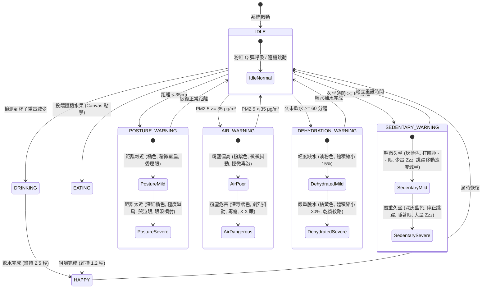

## Context

本專案「智慧物聯網健康輔助系統」旨在解決辦公族群長時間工作帶來的健康隱患。專案為全新開發，結合硬體感測裝置與桌面互動軟體，透過監測使用者的飲水行為、坐姿及室內空氣品質，並以桌面上的虛擬角色提供即時、遊戲化的回饋。有別於傳統單向通知，本系統強調即時連動與低干擾的互動體驗。

## Goals / Non-Goals

**Goals:**
- 實現硬體端（微控制器）與電腦端（Godot 應用程式）之間穩定、低延遲的區域網路資料通訊。
- 準確擷取各項感測器資料（Load Cell 測重、超音波距離、粉塵濃度），並建立有效的資料過濾機制。
- 開發具備「滑鼠穿透」及「背景透明」特性的桌面虛擬角色應用程式，確保不干擾使用者日常工作。
- 實作基於狀態機（State Machine）的角色動畫切換邏輯，將健康數據即時映射至視覺回饋。

**Non-Goals:**
- 不建立複雜的雲端資料庫系統或支援跨裝置帳號同步，專注於單機區域網路體驗。
- 不提供醫療等級的生理數據診斷（如心率、血壓）。
- 不使用攝影機進行深度學習影像辨識，以避免運算負擔及保護使用者隱私。

## Decisions

1. **硬體核心選擇 ESP32 晶片**
   - **Rationale**: ESP32 內建 Wi-Fi 模組，原生支援物聯網開發；且具備多組 I/O 腳位與足夠的運算能力，能同時處理測重模組、超音波與粉塵感測器的讀取及初步濾波。

2. **通訊協定採用 WebSocket 或輕量化 MQTT**
   - **Rationale**: 為了實現感測數據即時連動角色動畫，需要低延遲推播機制。若專注於單機環境，可直接在 ESP32 建立 WebSocket Server；若考慮擴充性，則可引入輕量 MQTT Broker。這兩者皆優於傳統的 HTTP Polling。

3. **桌面端開發引擎選擇 Godot Engine**
   - **Rationale**: Godot 原生強大支援 2D 像素美術（Pixel Art），且能輕易實作視窗屬性（如背景透明、永遠置頂）。相較於使用 Electron 或 Web 技術開發，Godot 擁有更低的系統資源消耗與更佳的動畫效能，適合長時間於背景運行的桌面寵物。

4. **隱私優先的感測策略（棄用攝影機）**
   - **Rationale**: 傳統姿勢辨識多依賴攝影機，這在辦公場域容易引發隱私疑慮。本設計改以超音波感測器（偵測與螢幕距離），達成無影像的坐姿距離評估。

## Risks / Trade-offs

- **[Risk] 感測器訊號雜訊與誤判**：如測重模組可能因桌面震動而誤判為飲水動作。
  - **Mitigation**：在微控制器端實作訊號去彈跳（Debounce）機制與移動平均濾波（Moving Average Filter），確保重量數據穩定一定時間後才判定為有效動作。
- **[Risk] 桌面角色干擾正常工作**：永遠置頂的視窗可能會遮擋重要的軟體介面或影響滑鼠點擊。
  - **Mitigation**：在 Godot 實作「滑鼠穿透（Click-through）」模式，並將角色體積縮小、預設安置於螢幕角落；僅在觸發健康警示時，才進行較大動作或音效提示。
- **[Risk] 高頻率資料傳輸導致效能下降**：感測器若傳輸頻率過高，可能造成 Godot 接收端負載增加。
  - **Mitigation**：在硬體端設定合理的傳輸頻率（如 2~5 Hz），且僅在資料發生有意義的改變時才傳送（Event-driven），降低整體網路與 CPU 負擔。

## 角色狀態機設計

本系統採用純網頁 Canvas 技術為虛擬寵物（果凍史萊姆 Jelly Slime）設計了基於物聯網感測器狀態驅動的階段性狀態機。

### 多重狀態疊加優先權 (Priority Order)
當使用者同時觸發多重不良健康狀態時，虛擬角色會依據以下優先權進行視覺外觀融合與主題顯示：
1. **粉塵危害 (Air Stage 2)** - PM2.5 >= 75 μg/m³ (優先度最高，最緊急)
2. **嚴重脫水 (Dehydration Stage 2)** - 久未飲水 >= 120 分鐘
3. **距離太近 (Posture Stage 2)** - 距離 < 25cm
4. **嚴重久坐 (Sedentary Stage 2)** - 久坐 >= 120 分鐘
5. **粉塵偏高 (Air Stage 1)** - PM2.5 >= 35 μg/m³
6. **輕度脫水 (Dehydration Stage 1)** - 久未飲水 >= 60 分鐘
7. **距離較近 (Posture Stage 1)** - 距離 < 35cm
8. **輕微久坐 (Sedentary Stage 1)** - 久坐 >= 60 分鐘
9. **正在吃水果 (Eating)** - 投餵隨機水果 (Canvas 點擊，保持當前本體色並顯示咀嚼動畫與碎屑)
10. **正在喝水 (Drinking)** - 智慧重量變化
11. **喝完水開心 (Happy)** - 原地跳躍與開花
12. **閒置 (Idle)** - 常規狀態

